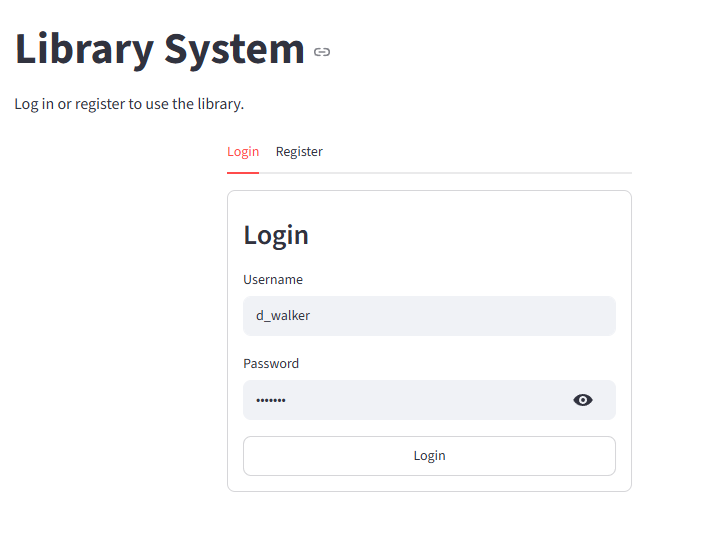
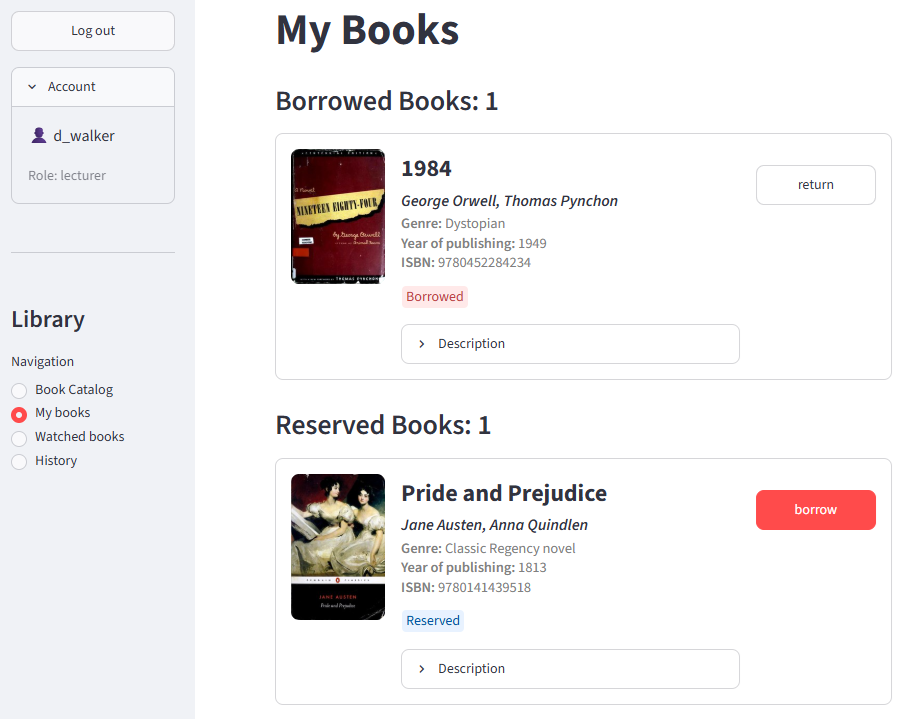
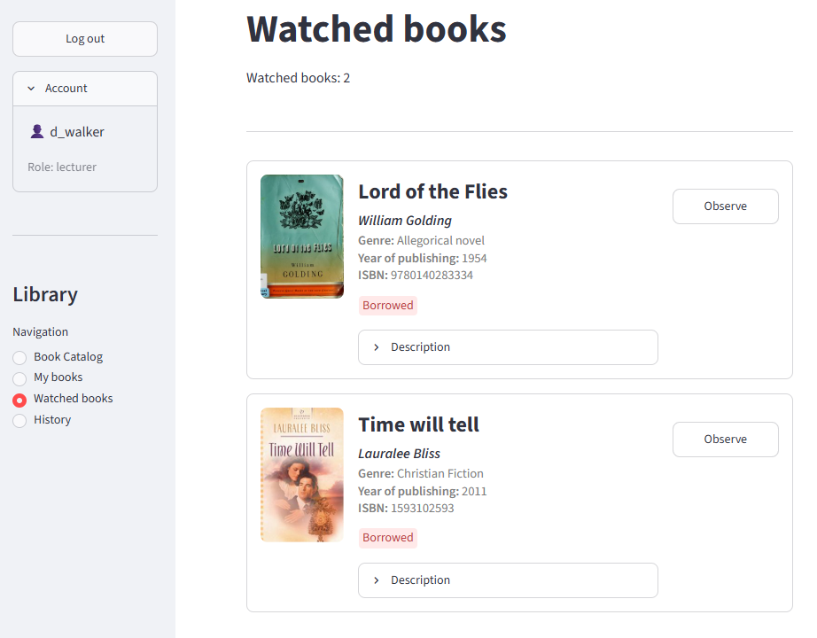
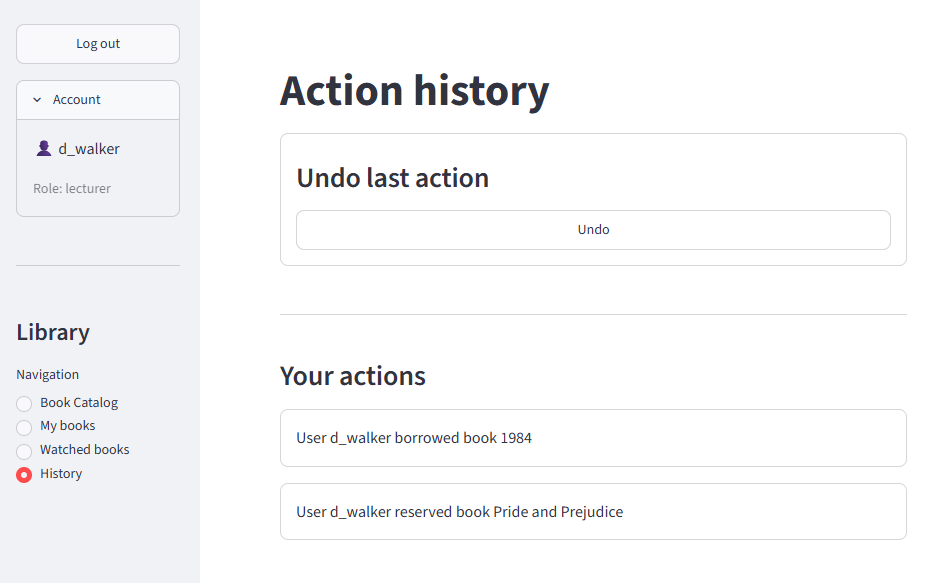
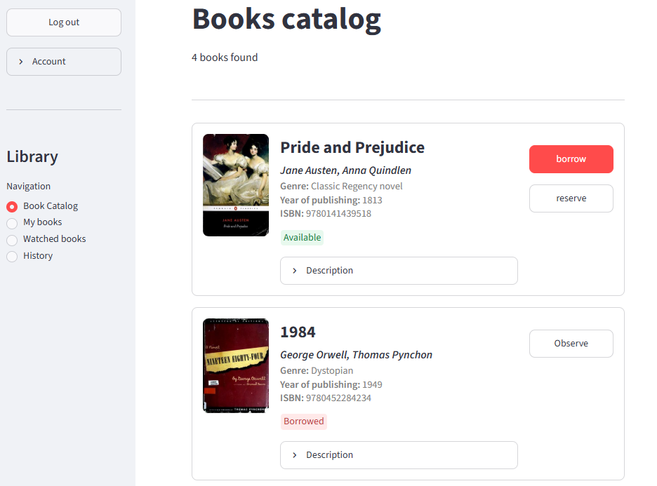
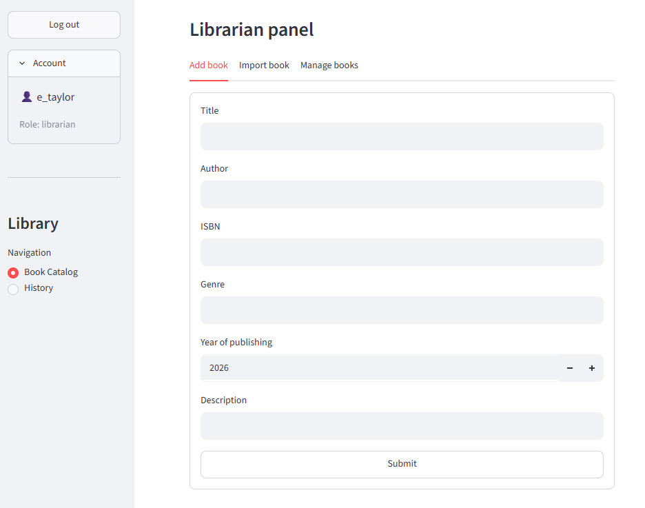

# Library Management System

A Streamlit-based library management application demonstrating classic object-oriented design patterns in a practical, real-world scenario. Users can browse a book catalog, borrow, return, reserve and watch books, while librarians can manage the catalog and import books from an external data source.

## Features

- **User authentication** — registration and login for three roles: Student, Lecturer, Librarian
- **Role-based permissions** — each role has a distinct set of allowed actions
- **Book catalog** — browse all books with cover images, descriptions, genre and publication year
- **Borrowing workflow** — borrow, return and reserve books, with state-dependent availability
- **Book watching** — get notified when a borrowed/reserved book you're watching becomes available again
- **Action history** — view a personal or system-wide history of actions, with undo support
- **External book import** — librarians can import book metadata from an external book service by ISBN
- **Librarian panel** — add, edit and remove books directly from the catalog view

## User Roles & Permissions

| Action | Student | Lecturer | Librarian |
|---|---|---|---|
| Borrow / Return book | ✅ | ✅ | ❌ |
| Reserve book | ❌ | ✅ | ❌ |
| Watch book | ✅ | ✅ | ❌ |
| Add / Remove / Update book | ❌ | ❌ | ✅ |
| Import book from external DB | ❌ | ❌ | ✅ |
| View own history / undo last action | ✅ | ✅ | ✅ |
| View history of all users | ❌ | ❌ | ✅ |

## Architecture & Design Patterns

This project is intentionally structured around several classic GoF design patterns:

- **Singleton** — `LibraryDatabase` ensures a single, shared in-memory book store
- **Factory Method** — `Factory` / `UserFactory` subclasses create `Student`, `Lecturer` and `Librarian` instances based on a role string
- **State** — `Book` delegates borrowing/returning/reserving logic to `AvailableBook`, `BorrowedBook` and `ReservedBook` state objects
- **Command** — `BorrowCommand`, `ReturnCommand` and `ReserveCommand` encapsulate book actions, enabling a history log and undo functionality via `CommandHistory`
- **Observer** — `Book` (as `Observable`) notifies watching `User`s (as `Observer`s) when it becomes available again
- **Proxy** — `LibraryProxy` wraps `LibraryService` and enforces permission checks before delegating to the real service
- **Adapter** — `BookAdapter` converts data from the external `BookService` into the application's `Book` model

## Project Structure

```
.
├── app.py                        # Streamlit entry point
├── controllers/
│   ├── app_controller.py         # Main app routing/navigation
│   ├── auth_service.py           # User registration & login
│   ├── book.py                   # Book entity + State pattern
│   ├── book_commands.py          # Command pattern implementations
│   ├── history.py                # Command history (undo/redo log)
│   ├── library_proxy.py          # Proxy enforcing permissions
│   └── library_service.py        # Core library business logic
├── models/
│   ├── base.py                   # LibraryReceiver + Command abstract base
│   ├── book_adapter.py           # Adapter for external book data
│   ├── external_book_data.py     # Mock external book service
│   ├── library_database.py       # Singleton in-memory book store
│   ├── observer.py               # Observable/Observer abstractions
│   ├── seed.py                   # Seed data for users and books
│   └── user.py                   # User roles + Factory pattern
├── views/
│   ├── history.py                 # History page (Streamlit UI)
│   ├── home.py                    # Book catalog page (Streamlit UI)
│   ├── login_registration.py      # Login/registration forms
│   ├── my_books.py                # "My Books" page
│   └── watched.py                 # "Watched Books" page
└── main.py                        # Standalone script demonstrating the domain logic (no UI)
```

## Tech Stack

- **Python 3.11+**
- **[Streamlit](https://streamlit.io/)** for the web UI

## Installation

1. Clone or download the project.
2. Install dependencies:

   ```bash
   pip install streamlit
   ```

## Running the App

```bash
streamlit run app.py
```

The app will seed three demo users and four demo books on first launch:

| Username | Password | Role |
|---|---|---|
| `e_taylor` | `pass987` | Librarian |
| `j_smith` | `pass1234` | Student |
| `d_walker` | `456pass` | Lecturer |


## Running the Standalone Demo Script

`main.py` exercises the domain/business logic directly (without the Streamlit UI) — registering users, importing/adding/removing books, borrowing, returning, and printing action history to the console:

```bash
python main.py
```

## Images

<p align="center">
   
</p>
<p align="center">
   
</p>
<p align="center">
   
</p>
<p align="center">
   
</p>
<p align="center">
   
</p>
<p align="center">
   
</p>

## Notes & Known Limitations

- All data (users, books, history) is stored **in memory** and is reset whenever the app restarts.
- Book cover images are fetched from Open Library using the book's ISBN and may not exist for every title.
- This project is intended as a design-pattern learning/demo exercise rather than a production-ready library system.